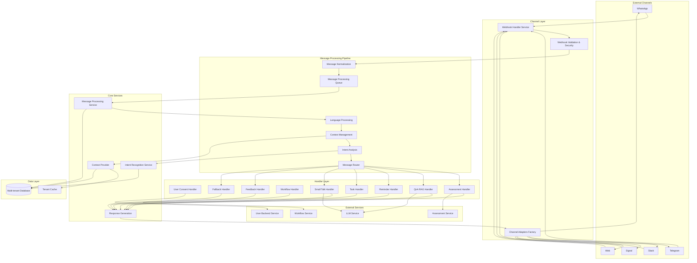
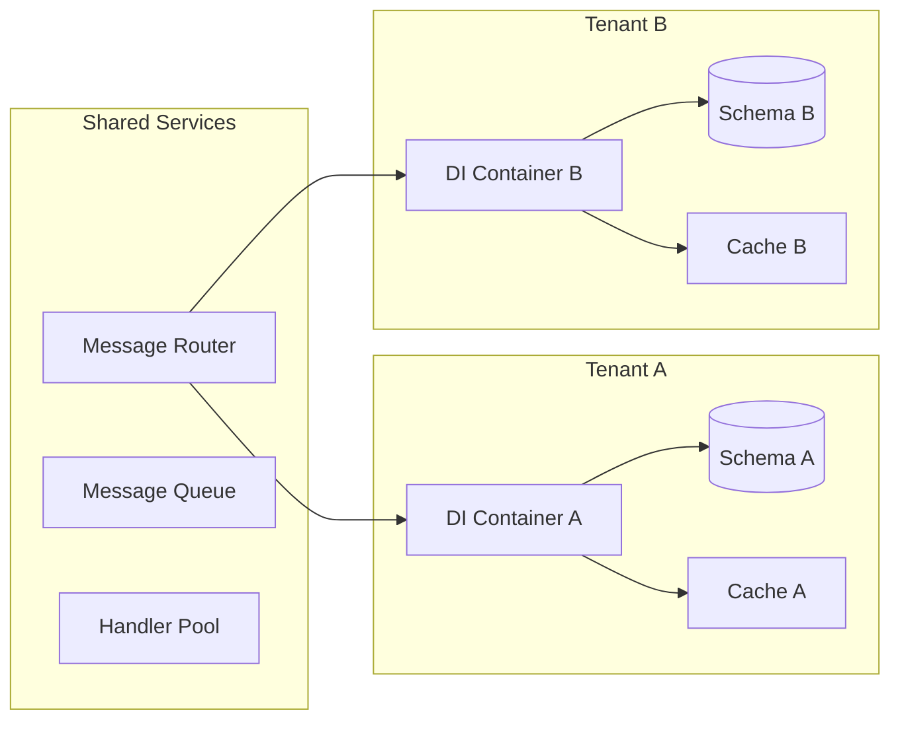

# Design Document

## Overview

The Chatbot Service is designed as a highly modular, multi-tenant conversational AI platform that processes messages from multiple channels, applies intelligent routing, and provides contextual responses through various specialized handlers. The architecture emphasizes separation of concerns, dependency injection, and extensibility while maintaining strict interface-based communication between modules.

The service follows a message-driven architecture where incoming messages flow through a pipeline of transformation, routing, and handling stages. Each stage is independently testable and replaceable, allowing for easy maintenance and feature extension.

## Architecture

### Message Processing Pipeline

Based on the existing implementation and requirements, the service follows this detailed message processing flow:

```
┌─────────────┐    ┌──────────────┐    ┌─────────────────┐
│   Channel   │──▶│   Webhook    │───▶│   Message       │
│  (WhatsApp, │    │   Received   │    │   Validation    │
│  Telegram,  │    │              │    │   & Security    │
│  Slack)     │    │              │    │                 │
└─────────────┘    └──────────────┘    └─────────┬───────┘
                                                 │
┌─────────────────────────────▼───────────────────────────┐
│              Message Normalization                      │
│  • Extract user ID, channel, timestamp                  │
│  • Convert to unified message format                    │
│  • Add message to processing queue                      │
└─────────────────────┬───────────────────────────────────┘
                      │
┌─────────────────────────────────────────▼─────────────────────────────────────┐
│                     Language Processing                                       │
│                                                                               │
│  ┌─────────────────┐    ┌─────────────────┐    ┌─────────────────────────────┐│
│  │   Detect        │    │   Translate     │    │   Update Message            ││
│  │   Language      │───▶│   if needed     │───▶│   with Language Info       ││
│  │   (Auto)        │    │   (Target: EN)  │    │                             ││
│  └─────────────────┘    └─────────────────┘    └─────────────────────────────┘│
└─────────────────────────────────────────┬─────────────────────────────────────┘
                                          │
┌─────────────────────────────────────────▼─────────────────────────────────────┐
│                     Context Management                                        │
│                                                                               │
│  ┌─────────────────┐    ┌─────────────────┐    ┌─────────────────────────────┐│
│  │   Load User     │    │   Update        │    │   Determine Current         ││
│  │   Context &     │───▶│   Conversation  │───▶│   Mode & State             ││
│  │   History       │    │   History       │    │   (Assessment/Chat/Task)    ││
│  └─────────────────┘    └─────────────────┘    └─────────────────────────────┘│
└─────────────────────────────────────────┬─────────────────────────────────────┘
                                          │
┌─────────────────────────────────────────▼─────────────────────────────────────┐
│                     Intent Analysis                                           │
│                                                                               │
│  ┌─────────────────┐    ┌─────────────────┐    ┌─────────────────────────────┐│
│  │   NLU Model     │    │   Intent        │    │   Confidence Scoring        ││
│  │   Processing    │───▶│   Classification│───▶│   & Threshold Check        ││
│  │   (NLP Engine)  │    │   (ML Model)    │    │                             ││
│  └─────────────────┘    └─────────────────┘    └─────────────────────────────┘│
└─────────────────────────────────────────┬─────────────────────────────────────┘
                                          │
                    ┌─────────────▼─────────────┐
                    │      Route Decision       │
                    │   Based on Intent &       │
                    │   Current Context         │
                    └─────────────┬─────────────┘
                                  │
┌─────────────────────────────────┼─────────────────────────────────┐
│                                 │                                 │
▼                                 ▼                                 ▼
┌───────────────┐              ┌─────────────────┐              ┌─────────────────┐
│  Assessment   │              │   RAG/LLM       │              │   Task/Reminder │
│   Handler     │              │   Processing    │              │    Handler      │
│               │              │                 │              │                 │
│ • Question    │              │ • Knowledge     │              │ • Schedule Task │
│   Flow        │              │   Retrieval     │              │ • Send Reminder │
│ • Progress    │              │ • LLM Response  │              │ • Update Status │
│ • Validation  │              │ • Context Aware │              │                 │
└───────┬───────┘              └─────────┬───────┘              └─────────┬───────┘
        │                                │                                │
        └─────────────────┬──────────────┘                                │
                          │                                               │
                          ┌─────▼──────┐                                  │
                          │  Response  │◀─────────────────────────────────┘
                          │ Generation │
                          └─────┬──────┘
                                │
                          ┌─────▼──────┐
                          │   Send     │
                          │ Response   │
                          │ to Channel │
                          └────────────┘
```

### High-Level Architecture



### Multi-Tenant Architecture

The service implements schema-based multi-tenancy where each tenant has:
- Isolated database schema with identical structure
- Tenant-specific configuration cache
- Scoped dependency injection containers
- Isolated message processing pipelines



## Components and Interfaces

### 1. Channel Module

**Purpose**: Handles multi-channel message reception and transmission with channel-specific adaptations.

**Key Interfaces**:
```typescript
interface IChannelAdapter {
    receiveMessage(request: ChannelRequest): Promise<CommonMessage>;
    sendMessage(message: CommonMessage): Promise<ChannelResponse>;
    validateToken(token: string): Promise<boolean>;
    transformToCommon(channelMessage: any): CommonMessage;
    transformFromCommon(message: CommonMessage): any;
}

interface IChannelManager {
    registerAdapter(channel: ChannelType, adapter: IChannelAdapter): void;
    getAdapter(channel: ChannelType): IChannelAdapter;
    processIncomingMessage(tenantCode: string, channel: ChannelType, token: string, payload: any): Promise<void>;
    sendOutgoingMessage(tenantCode: string, channel: ChannelType, token: string, message: CommonMessage): Promise<boolean>;
}
```

**Endpoints**:
- `POST /messages/receive/tenants/:tenantCode/channels/:channel/tokens/:token`
- `POST /messages/send/tenants/:tenantCode/channels/:channel/tokens/:token`

### 2. Message Queue Module

**Purpose**: Provides asynchronous message processing with priority handling and retry mechanisms.

**Key Interfaces**:
```typescript
interface IMessageQueue {
    enqueue(message: QueuedMessage): Promise<void>;
    dequeue(): Promise<QueuedMessage | null>;
    peek(): Promise<QueuedMessage | null>;
    size(): Promise<number>;
    clear(): Promise<void>;
}

interface IQueueProcessor {
    start(): Promise<void>;
    stop(): Promise<void>;
    processMessage(message: QueuedMessage): Promise<void>;
    handleError(message: QueuedMessage, error: Error): Promise<void>;
}
```

### 3. Message Transformation Module

**Purpose**: Converts messages between formats and applies language processing transformations.

**Key Interfaces**:
```typescript
interface IMessageTransformer {
    transform(message: CommonMessage): Promise<CommonMessage>;
    translateText(text: string, targetLanguage: string): Promise<string>;
    transcribeAudio(audioUrl: string): Promise<string>;
    extractTextFromImage(imageUrl: string): Promise<string>;
    extractTextFromVideo(videoUrl: string): Promise<string>;
}

interface ITransformationPipeline {
    addTransformer(transformer: IMessageTransformer): void;
    removeTransformer(transformerId: string): void;
    process(message: CommonMessage): Promise<CommonMessage>;
}
```

### 4. Message Router Module

**Purpose**: Intelligently routes messages to appropriate handlers based on context and intent analysis.

**Key Interfaces**:
```typescript
interface IMessageRouter {
    route(message: CommonMessage, context: ConversationContextData): Promise<HandlerType>;
    registerHandler(type: HandlerType, handler: IMessageHandler): void;
    getHandler(type: HandlerType): IMessageHandler;
    determineRoutingStrategy(message: CommonMessage, context: ConversationContextData): Promise<RoutingStrategy>;
}

interface IRoutingStrategy {
    evaluate(message: CommonMessage, context: ConversationContextData): Promise<RoutingDecision>;
    getPriority(): number;
    getName(): string;
}
```

### 5. Context Provider Module

**Puose**: Manages conversation context, history, and user state across interactions.

**Key Interfaces**:
```typescript
interface IContextProvider {
    getContext(conversationId: string): Promise<ConversationContextData | null>;
    createContext(data: CreateContextDto): Promise<ConversationContextData>;
    updateContext(conversationId: string, data: UpdateContextDto): Promise<ConversationContextData | null>;
    summarizeHistory(conversationId: string, maxTokens?: number): Promise<string>;
    clearExpiredContexts(): Promise<number>;
}

interface IContextManager {
    switchMode(conversationId: string, mode: ContextMode): Promise<boolean>;
    switchHandler(conversationId: string, handler: HandlerType): Promise<boolean>;
    setVariable(conversationId: string, key: string, value: any): Promise<boolean>;
    getVariable(conversationId: string, key: string): Promise<any>;
}
```

### 6. Intent Recognition Module

**Purpose**: Identifies user intents and extracts entities from natural language input.

**Key Interfaces**:
```typescript
interface IIntentRecognizer {
    recognizeIntent(text: string, context: IntentContext): Promise<IntentRecognitionResult>;
    extractEntities(text: string, entities: EntityDefinition[]): Promise<ExtractedEntity[]>;
    validateEntities(entities: ExtractedEntity[], required: EntityDefinition[]): Promise<IntentMatchResult>;
}

interface IIntentMatcher {
    matchIntent(text: string, availableIntents: IntentConfig[]): Promise<IntentMatchResult>;
    calculateConfidence(text: string, intent: IntentConfig): Promise<number>;
    findBestMatch(scores: IntentScore[], threshold: number): IntentScore | null;
}
```

### 7. Message Handlers

**Purpose**: Specialized handlers for different types of conversations and interactions.

**Base Interface**:
```typescript
interface IMessageHandler {
    canHandle(message: CommonMessage, context: ConversationContextData): Promise<boolean>;
    handle(message: CommonMessage, context: ConversationContextData): Promise<HandlerResponse>;
    getHandlerType(): HandlerType;
    getPriority(): number;
}

interface HandlerResponse {
    success: boolean;
    response?: CommonMessage;
    contextUpdates?: Partial<ConversationContextData>;
    nextHandler?: HandlerType;
    error?: Error;
    metadata?: Record<string, any>;
}
```

**Specific Handler Interfaces**:
```typescript
interface IQnAHandler extends IMessageHandler {
    queryKnowledgeBase(query: string, context: ConversationContextData): Promise<string>;
    generateResponse(query: string, ragResult: string): Promise<string>;
}

interface IAssessmentHandler extends IMessageHandler {
    startAssessment(assessmentId: string, context: ConversationContextData): Promise<void>;
    processAssessmentResponse(response: string, context: ConversationContextData): Promise<void>;
    completeAssessment(context: ConversationContextData): Promise<AssessmentResult>;
}

interface IWorkflowHandler extends IMessageHandler {
    startWorkflow(workflowId: string, context: ConversationContextData): Promise<void>;
    processWorkflowStep(input: string, context: ConversationContextData): Promise<void>;
    completeWorkflow(context: ConversationContextData): Promise<WorkflowResult>;
}
```

### 8. External Service Integration

**Purpose**: Provides interfaces for communicating with external services.

**Key Interfaces**:
```typescript
interface IGenAIService {
    generateResponse(prompt: string, context?: string): Promise<string>;
    analyzeIntent(text: string, intents: string[]): Promise<IntentAnalysis>;
    extractEntities(text: string, entityTypes: string[]): Promise<EntityExtractionResult>;
    summarizeText(text: string, maxLength?: number): Promise<string>;
}

interface IUserBackendService {
    getUserProfile(userId: string): Promise<UserProfile>;
    updateUserProfile(userId: string, updates: Partial<UserProfile>): Promise<UserProfile>;
    getUserPreferences(userId: string): Promise<UserPreferences>;
    logUserInteraction(userId: string, interaction: UserInteraction): Promise<void>;
}

interface IWorkflowService {
    getWorkflow(workflowId: string): Promise<WorkflowDefinition>;
    executeWorkflowStep(workflowId: string, stepId: string, input: any): Promise<WorkflowStepResult>;
    getWorkflowStatus(workflowId: string, instanceId: string): Promise<WorkflowStatus>;
}

interface IAssessmentService {
    getAssessment(assessmentId: string): Promise<AssessmentDefinition>;
    submitAssessmentResponse(assessmentId: string, instanceId: string, responses: AssessmentResponse[]): Promise<AssessmentResult>;
    getAssessmentProgress(assessmentId: string, instanceId: string): Promise<AssessmentProgress>;
}
```

## Data Models

### Core Message Model
```typescript
interface CommonMessage {
    id: string;
    conversationId: string;
    userId?: string;
    tenantCode: string;
    channel: ChannelType;
    messageType: MessageType;
    direction: MessageDirection;
    content: MessageContent;
    metadata?: MessageMetadata;
    processedContent?: ProcessedMessageContent;
    status: MessageStatus;
    timestamp: Date;
    createdAt: Date;
    updatedAt: Date;
}
```

### Context Data Model
```typescript
interface ConversationContextData {
    conversationId: string;
    userId: string;
    tenantCode: string;
    channel: ChannelType;
    currentMode: ContextMode;
    currentHandler: HandlerType;
    state: ContextState;
    priority: ContextPriority;
    sessionData: SessionData;
    userProfile: UserContextProfile;
    conversationFlow: ConversationFlow;
    metadata: ContextMetadata;
    createdAt: Date;
    updatedAt: Date;
    expiresAt?: Date;
}
```

### Intent Configuration Model
```typescript
interface IntentConfig {
    id: string;
    tenantCode: string;
    name: string;
    displayName?: string;
    description?: string;
    category: IntentCategory;
    priority: IntentPriority;
    isActive: boolean;
    handlerType: HandlerType;
    thresholdScore: number;
    requiredEntities: EntityDefinition[];
    optionalEntities?: EntityDefinition[];
    utterances: string[];
    responses?: IntentResponse[];
    handlerConfig?: HandlerConfig;
    metadata?: Record<string, any>;
    createdAt: Date;
    updatedAt?: Date;
}
```

### Database Schema Design

**Multi-tenant Schema Structure**:
- Each tenant gets a separate schema: `tenant_{tenantCode}`
- Common tables across all tenant schemas:
  - `conversations`
  - `messages`
  - `contexts`
  - `intents`
  - `entities`
  - `user_profiles`
  - `handler_configs`
  - `analytics`

**Key Tables**:
```sql
-- Conversations table
CREATE TABLE conversations (
    id VARCHAR(36) PRIMARY KEY,
    user_id VARCHAR(36),
    channel ENUM('whatsapp', 'telegram', 'slack', 'signal', 'web'),
    status ENUM('active', 'paused', 'completed', 'archived'),
    created_at TIMESTAMP DEFAULT CURRENT_TIMESTAMP,
    updated_at TIMESTAMP DEFAULT CURRENT_TIMESTAMP ON UPDATE CURRENT_TIMESTAMP,
    INDEX idx_user_channel (user_id, channel),
    INDEX idx_status_updated (status, updated_at)
);

-- Messages table
CREATE TABLE messages (
    id VARCHAR(36) PRIMARY KEY,
    conversation_id VARCHAR(36) NOT NULL,
    user_id VARCHAR(36),
    channel ENUM('whatsapp', 'telegram', 'slack', 'signal', 'web'),
    message_type ENUM('text', 'image', 'audio', 'video', 'document', 'location', 'interactive'),
    direction ENUM('inbound', 'outbound'),
    content JSON,
    metadata JSON,
    processed_content JSON,
    status ENUM('pending', 'sent', 'delivered', 'read', 'failed', 'processing'),
    timestamp TIMESTAMP,
    created_at TIMESTAMP DEFAULT CURRENT_TIMESTAMP,
    updated_at TIMESTAMP DEFAULT CURRENT_TIMESTAMP ON UPDATE CURRENT_TIMESTAMP,
    FOREIGN KEY (conversation_id) REFERENCES conversations(id),
    INDEX idx_conversation_timestamp (conversation_id, timestamp),
    INDEX idx_user_channel_type (user_id, channel, message_type)
);

-- Contexts table
CREATE TABLE contexts (
    conversation_id VARCHAR(36) PRIMARY KEY,
    user_id VARCHAR(36) NOT NULL,
    channel ENUM('whatsapp', 'telegram', 'slack', 'signal', 'web'),
    current_mode ENUM('normal', 'assessment', 'workflow', 'menu', 'form'),
    current_handler ENUM('UserConsent', 'QnARag', 'Assessment', 'Workflow', 'Reminder', 'Task', 'Intent', 'SmallTalk', 'Feedback', 'Fallback'),
    state ENUM('active', 'paused', 'waiting', 'processing', 'completed', 'failed', 'expired'),
    priority TINYINT DEFAULT 2,
    session_data JSON,
    user_profile JSON,
    conversation_flow JSON,
    metadata JSON,
    created_at TIMESTAMP DEFAULT CURRENT_TIMESTAMP,
    updated_at TIMESTAMP DEFAULT CURRENT_TIMESTAMP ON UPDATE CURRENT_TIMESTAMP,
    expires_at TIMESTAMP,
    FOREIGN KEY (conversation_id) REFERENCES conversations(id),
    INDEX idx_user_mode_state (user_id, current_mode, state),
    INDEX idx_expires_at (expires_at)
);
```

## Error Handling

### Error Classification
```typescript
enum ErrorType {
    ValidationError = 'ValidationError',
    AuthenticationError = 'AuthenticationError',
    AuthorizationError = 'AuthorizationError',
    NotFoundError = 'NotFoundError',
    ConflictError = 'ConflictError',
    ExternalServiceError = 'ExternalServiceError',
    DatabaseError = 'DatabaseError',
    NetworkError = 'NetworkError',
    TimeoutError = 'TimeoutError',
    InternalError = 'InternalError'
}

interface ServiceError extends Error {
    type: ErrorType;
    code: string;
    statusCode: number;
    details?: Record<string, any>;
    cause?: Error;
    timestamp: Date;
    requestId?: string;
ode?: string;
}
```

### Error Handling Strategy
1. **Input Validation**: Joi schemas for request validation
2. **Service Layer**: Try-catch blocks with specific error types
3. **Global Handler**: Express error middleware for unhandled errors
4. **Logging**: Structured error logging with correlation IDs
5. **User-Friendly**: Convert technical errors to user-friendly messages
6. **Retry Logic**: Exponential backoff for transient failures

### Circuit Breaker Pattern
```typescript
interface ICircuitBreaker {
    execute<T>(operation: () => Promise<T>): Promise<T>;
    getState(): CircuitBreakerState;
    reset(): void;
}

enum CircuitBreakerState {
    Closed = 'closed',
    Open = 'open',
    HalfOpen = 'half-open'
}
```

## Testing Strategy

### Unit Testing
- **Framework**: Jest with TypeScript support
- **Coverage**: Minimum 80% code coverage
- **Mocking**: Mock external dependencies using Jest mocks
- **Test Structure**: AAA pattern (Arrange, Act, Assert)

### Integration Testing
- **Database**: In-memory SQLite for fast tests
- **External Services**: Mock servers using MSW (Mock Service Worker)
- **API Testing**: Supertest for HTTP endpoint testing
- **Container Testing**: Test dependency injection containers

### End-to-End Testing
- **Bruno Collections**: API testing scenarios
- **Message Flow**: Complete message processing pipeline tests
- **Multi-tenant**: Tenant isolation verification
- **Channel Integration**: Mock channel webhook testing

### Test Organization
```
src/
├── modules/
│   ├── channel/
│   │   ├── __tests__/
│   │   │   ├── unit/
│   │   │   ├── integration/
│   │   │   └── fixtures/
│   │   └── channel.service.ts
│   └── ...
├── __tests__/
│   ├── e2e/
│   ├── helpers/
│   └── setup/
└── ...
```

### Testing Utilities
```typescript
interface TestHelpers {
    createMockMessage(overrides?: Partial<CommonMessage>): CommonMessage;
    createMockContext(overrides?: Partial<ConversationContextData>): ConversationContextData;
    setupTestDatabase(tenantCode: string): Promise<void>;
    cleanupTestDatabase(tenantCode: string): Promise<void>;
    mockExternalService(service: string, responses: any[]): void;
}
```

## Observability and Monitoring

### OpenTelemetry Integration
- **Tracing**: Distributed tracing across service boundaries
- **Metrics**: Custom metrics for business logic
- **Logging**: Structured logging with trace correlation
- **Non-intrusive**: Centralized span management

### Key Metrics
```typescript
interface ServiceMetrics {
    messageProcessingTime: Histogram;
    messageProcessingRate: Counter;
    activeConversations: Gauge;
    handlerExecutionTime: Histogram;
    intentRecognitionAccuracy: Histogram;
    externalServiceLatency: Histogram;
    errorRate: Counter;
    tenantUsage: Counter;
}
```

### Tracing Strategy
```typescript
// Centralized tracing in telemetry/tracer.ts
class ServiceTracer {
    startMessageProcessing(messageId: string): Span;
    startHandlerExecution(handlerType: HandlerType, messageId: string): Span;
    startExternalServiceCall(service: string, operation: string): Span;
    recordError(span: Span, error: Error): void;
    recordMetric(name: string, value: number, labels?: Record<string, string>): void;
}
```

### Health Checks
```typescript
interface IHealthCheck {
    name: string;
    check(): Promise<HealthStatus>;
}

interface HealthStatus {
    status: 'healthy' | 'unhealthy' | 'degraded';
    details?: Record<string, any>;
    timestamp: Date;
}
```

## Security Considerations

### Authentication & Authorization
- **Token Validation**: Channel-specific token validation
- **Tenant Isolation**: Strict tenant data separation
- **API Security**: Rate limiting and request validation
- **Secrets Management**: Environment-based configuration

### Data Protection
- **Encryption**: At-rest and in-transit encryption
- **PII Handling**: Anonymization and data retention policies
- **Audit Logging**: Security event logging
- **Input Sanitization**: XSS and injection prevention

### Network Security
- **HTTPS Only**: TLS 1.2+ for all communications
- **CORS Configuration**: Restricted cross-origin requests
- **Request Size Limits**: Prevent DoS attacks
- **IP Whitelisting**: Channel webhook IP restrictions

## Performance Optimization

### Caching Strategy
- **Tenant Settings**: In-memory cache with TTL
- **User Contexts**: Redis cache for active conversations
- **Intent Configs**: Application-level cache with invalidation
- **Response Templates**: Compiled template caching

### Database Optimization
- **Connection Pooling**: Per-tenant connection pools
- **Query Optimization**: Indexed queries and query analysis
- **Read Replicas**: Separate read/write operations
- **Partitioning**: Time-based message partitioning

### Message Processing
- **Queue Optimization**: Priority-based message queuing
- **Batch Processing**: Bulk operations where possible
- **Async Processing**: Non-blocking message handling
- **Resource Pooling**: Handler instance pooling

## Deployment Architecture

### Container Strategy
```dockerfile
# Multi-stage build for optimization
FROM node:18-alpine AS builder
WORKDIR /app
COPY package*.json ./
RUN npm ci --only=production

FROM node:18-alpine AS runtime
WORKDIR /app
COPY --from=builder /app/node_modules ./node_modules
COPY dist ./dist
EXPOSE 3000
CMD ["node", "dist/index.js"]
```

### Environment Configuration
```typescript
interface EnvironmentConfig {
    NODE_ENV: 'development' | 'staging' | 'production';
    PORT: number;
    DATABASE_URL: string;
    REDIS_URL: string;
    LLM_SERVICE_URL: string;
    USER_BACKEND_URL: string;
    WORKFLOW_SERVICE_URL: string;
    ASSESSMENT_SERVICE_URL: string;
    OPENTELEMETRY_ENDPOINT: string;
    LOG_LEVEL: 'debug' | 'info' | 'warn' | 'error';
}
```

### Scaling Considerations
- **Horizontal Scaling**: Stateless service design
- **Load Balancing**: Session affinity for WebSocket connections
- **Database Scaling**: Read replicas and sharding strategies
- **Queue Scaling**: Distributed message queuing
- **Cache Scaling**: Redis clustering for high availability
