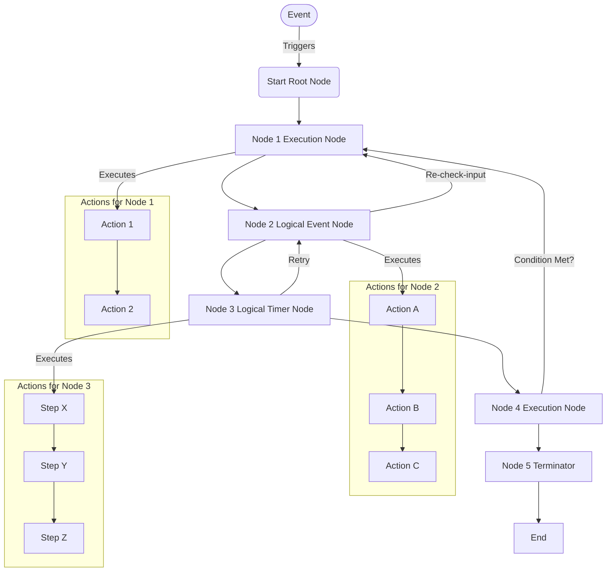
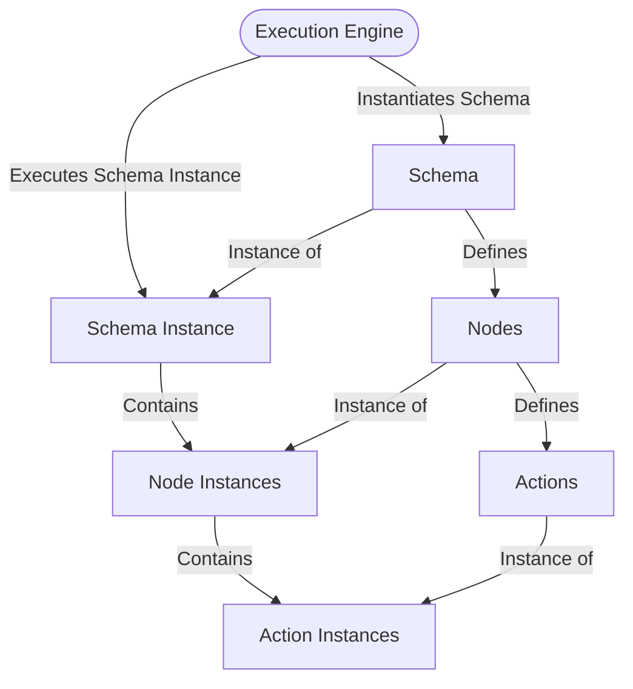

# Schema

Schema is a representation of the workflow. It defines the structure of the workflow, the nodes and the connections between them. Schema is just like a template of the workflow. It is used to create instances of the workflow. An instance of the schema is called as workflow instance or schema instance.

Most of the time schema is directional graph, but not necessarily it is acyclic. Hence it cannot be called a purely DAG (Directional Cyclic Graph). It may contain certain local cyclic components.

It has nodes and connections between them. There are several types of nodes each having a different purpose and different behaviour. A node may have one or more actions associated with it. Actions are the nothing but tasks that are executed when the node is triggered. The actions are listed in a given sequence and are executed in the same order.

Following is the typical example of a workflow.

## Schema Execution

Schema execution is the process of creating an instance of the schema and executing it. The schema instance is created by instantiation the schema. Once the schema instance is created, it is ready to be executed by the schema execution engine. The schema execution engine is responsible for managing the execution of the schema instance.

### Schema Instantiation
The creation of the schema instance can be triggered by an event or it can be done manually. For each scema instance, there is a unique instance id. The instance id is used to track the instance and its execution. The instance id is generated by the system and is unique across all instances.

Each node in the schema is also instantiated. The node instance is created for each node in the schema. The node instance is used to track the execution of the node.

For each of the node instance, the node actions are also instantiated. The action instance is created for each action in the node. The action instance is used to track the execution of the action.

Here is a diagram that illustrates the relationship between the schema, nodes, actions, and their corresponding instances and how their instances are created during execution.

### Definitions
1. **Schema Execution Engine**: Responsible for instantiating the schema and creating the schema instance.
2. **Schema**: Represents the overall workflow structure.
3. **Schema Instance**: A unique instance of the schema created during execution.
4. **Nodes**: Components of the schema that define specific tasks or logic.
5. **Node Instances**: Instantiated versions of nodes, created for each schema instance.
6. **Actions**: Tasks associated with nodes.
7. **Action Instances**: Instantiated versions of actions, created for each node instance.

This diagram emphasizes the parallel relationship between the schema, nodes, and actions with their respective instances, and the role of the **Schema Execution Engine** in managing the instantiation process.

### Execution Process

Schema instance execution process is handled by Schema Execution Engine. The engine is responsible for managing the execution of the schema instance. It is responsible for triggering the nodes, executing the actions, and managing the flow of the schema instance.
The **Schema Execution Engine** is a transient engine in a way that it does not store any state information. It is stateless and does not store any information about the schema instance.
The schema instance is executed node by node. It starts with the very first node in the workflow called as **Root Node**. Each node in the schema instance is executed in the parent-child order defined in the schema. Unless all the action instances of a node are executed, the next node is not triggered. The schema instance is executed until the last node (**Terminator Node**) is executed. Once the last node is executed, the schema instance is marked as completed.

### State Management
The schema execution engine is a transient stateless engine, it does not store any state information.
Actual state information is stored in the schema instance. The state is stored as a storage-object called as '**Alamanc**' in a key-value pairs format. Apart from this the schema instance also stores the currently executing node instance. All the state information about the schema instance is serialized to database right away and retrieved from the database. This is done to make sure that even if there any service restarts or any other process issues, we always get the latest state without the loss or inconsistency.
This also helps in scenarios where the schema instance is paused at a given node instance and to be resumed later once certain information is available, the new schema engine class object can resume the operation. All the incoming triggers or events are queued so that it is also possible to have multiple schema engines working on same schema instance and even with that state inconsistencies are avoided due to queued sequential nature of the execution.

## Schema Instance Context
It is not always possible to redirect the incoming event/message/trigger to a correct schema instance during execution. This is true in schenarios where workflow is chat-bot or conversation based as multiple users may be interacting with the same chat-bot.
In such cases, the schema instance context is used to identify the schema instance to redirect the incoming event to. The context is stored as a key-value pair in the schema instance and is also always serialized to the database. The context is used to identify the schema instance and the current node instance to redirect the incoming event to.
So in such scenarios, the incoming event characteristics are matched with the schema instance context and the schema instance is identified and the event is redirected to the correct schema instance.

## Children Schema
A schema can have children schema. The children schema is a schema that represents an isolated part of the parent schema and could be executed separately. The children schema is used to define a sub-workflow that can be executed independently. The children schema is often used to define a complex workflow in a modular way.
The children schema instance is executed as a separate schema instance. The children schema are generally triggered by the event emitted from parent schema. The children schema can also have its own children schema.
Most of the parent schema instance context is shared with the children schema instance. The children schema instance can also have its own context. The children schema instance has its own state information (**Almanac**).
The execution of the children schema instance is managed by the new schema execution engine instance. Children schema can update Almanac or parent schema or vice versa. There are some actions specifically designed to update Almanac (State) of the parent schema instance or children schema instance.
